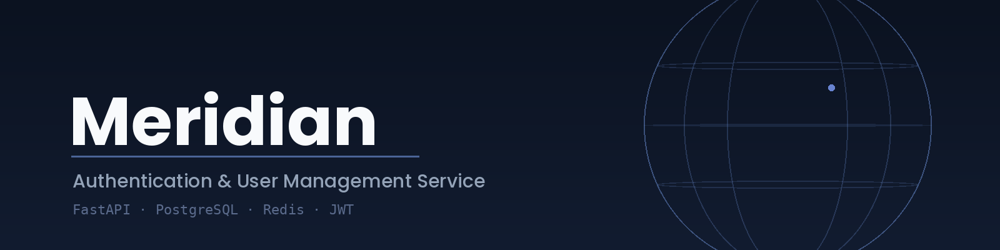
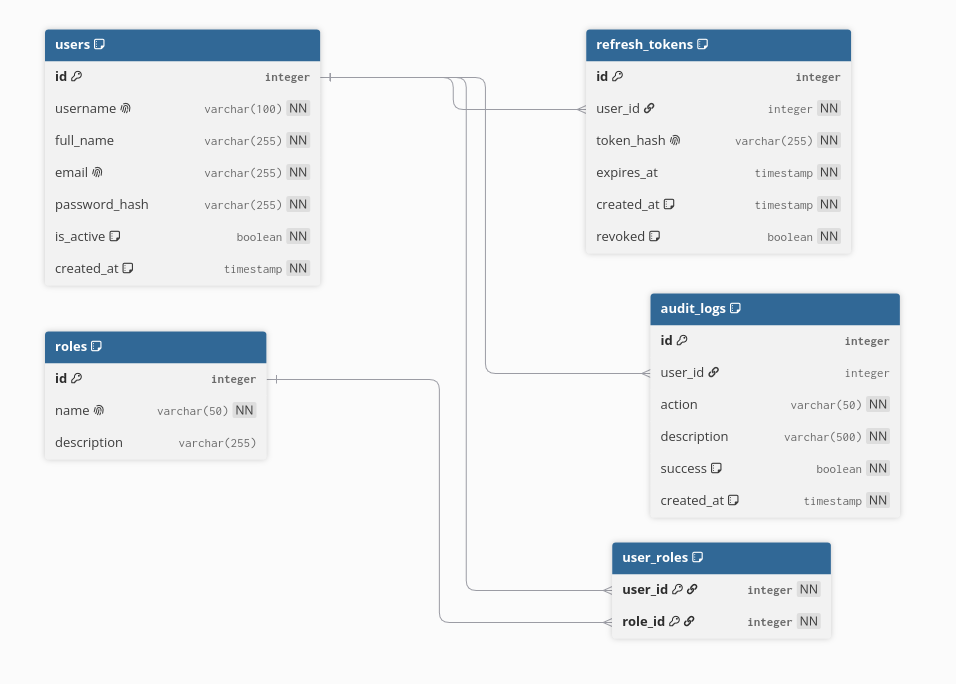

<div align="center">



# Meridian

[](https://www.python.org/)
[](https://fastapi.tiangolo.com/)
[](https://www.postgresql.org/)
[](https://redis.io/)
[](https://sqlmodel.tiangolo.com/)
[](https://jwt.io/)
[](https://github.com/hynek/argon2_cffi)
[](https://www.docker.com/)
[](LICENSE)

</div>

> Meridian is a backend authentication and user-management service built with FastAPI, PostgreSQL and Redis.

Meridian provides the core functionality required by a modern authentication service: user registration, login, JWT access tokens, refresh-token rotation, logout, role-based authorization, profile management, audit logging, Redis-backed caching, system metrics over WebSocket, and administrator-oriented user statistics.

---

## Features

### Authentication

- User registration
- Login by username or email
- JWT access tokens
- Refresh tokens
- Refresh-token rotation
- Refresh-token reuse detection
- Logout of the current session
- Logout from all sessions
- Argon2 password hashing
- Asynchronous password verification using a background thread
- Role-based access control

### User management

- Get the current user
- Get a user by ID
- Search users
- Update the current user's profile
- Administrator user updates
- Username uniqueness validation
- Email uniqueness validation
- Password change with current-password verification
- Account activation/deactivation
- User roles management

### Audit logging

Meridian records security-sensitive operations in an audit log, including:

- Successful logins
- Failed logins
- Registration attempts
- Profile updates
- Password changes
- Administrator user updates
- Role changes
- Account activation/deactivation
- Refresh-token rotation
- Refresh-token reuse detection
- Other authentication failures

Audit records support filtering and pagination and can be exported as CSV.

### Statistics

Administrator endpoints provide:

- Total users
- Active users
- Blocked users
- Monthly registration statistics for a selected year

Registration statistics are returned for all 12 months, including months with zero registrations, which makes the response suitable for a line chart.

### Redis caching

Redis is used to reduce repeated PostgreSQL queries for:

- User details
- User search results
- Audit log search results
- User statistics
- Monthly registration statistics

Cached values are invalidated when relevant data changes.

### WebSocket metrics

The service can expose live system metrics over WebSocket for administrators, such as:

- CPU usage
- Memory usage
- Memory used in MB

---

## Architecture

The application follows a layered architecture:

```text
Routers
   ↓
Facades
   ↓
Services
   ↓
Repositories
   ↓
PostgreSQL

Services
   ↓
RedisCache
   ↓
Redis
```

Authentication-related components are separated into dedicated services such as:

```text
RegistrationService
LoginService
RefreshTokenService
LogoutService
UserUpdateService
AuditLogService
```

---

## Tech Stack

| Technology | Purpose |
|---|---|
| Python | Main programming language |
| FastAPI | REST API and WebSocket endpoints |
| SQLModel | SQL models and ORM layer |
| SQLAlchemy Async | Asynchronous database access |
| PostgreSQL | Primary relational database |
| Redis | Caching |
| JWT | Access-token authentication |
| Argon2 | Password hashing |
| Docker Compose | Local/containerized deployment |
| pgAdmin | PostgreSQL administration |
| Locust | Load testing |
| psutil | System metrics |

---

## Database Schema

<div align="center">



</div>

The schema is centered on the `users` table. `refresh_tokens` and `audit_logs` reference it
directly (`audit_logs.user_id` is nullable, since failed logins may not resolve to a known user).
`roles` is a reusable reference catalog, linked to `users` through the association table
`user_roles`, which uses a composite primary key of `(user_id, role_id)`.

The file [`schema.dbml`](./schema.dbml) can be pasted directly into
**[dbdiagram.io](https://dbdiagram.io)** to produce an interactive, editable diagram.

<details>
<summary>Tables</summary>

| Table | Purpose |
|---|---|
| `users` | application user accounts |
| `roles` | reference catalog of roles used for authorization |
| `user_roles` | many-to-many association between users and roles |
| `refresh_tokens` | hashed refresh tokens, supporting rotation and reuse detection |
| `audit_logs` | persistent log of security-relevant events |

</details>

---

## Project Structure

A typical project structure is:

```text
Meridian/
├── app/
│   ├── config/
│   │   ├── config.py
│   │   ├── database.py
│   │   └── redis.py
│   │
│   ├── facades/
│   │   ├── auth.py
│   │   ├── audit.py
│   │   └── user.py
│   │
│   ├── models/
│   │   ├── ...
│   │
│   ├── repositories/
│   │   ├── audit.py
│   │   ├── refresh_token.py
│   │   ├── role.py
│   │   └── user.py
│   │
│   ├── routers/
│   │   ├── auth.py
│   │   ├── audit.py
│   │   ├── metrics.py
│   │   └── user.py
│   │
│   ├── schemas/
│   │   ├── audit.py
│   │   ├── user.py
│   │   └── ...
│   │
│   ├── services/
│   │   ├── login.py
│   │   ├── logout.py
│   │   ├── refresh.py
│   │   ├── registration.py
│   │   ├── user.py
│   │   └── audit.py
│   │
│   ├── utils/
│   │   ├── jwt.py
│   │   ├── jwt_auth.py
│   │   ├── password.py
│   │   ├── redis.py
│   │   └── refresh_token.py
│   │
│   └── .env
│
├── Dockerfile
├── docker-compose.yml
├── requirements.txt
├── schema.dbml
├── erd.png
├── banner.png
└── README.md
```

The exact names may differ depending on the current project layout.

---

# Configuration

Meridian reads database, Redis and JWT settings from environment variables.

Example `.env`:

```env
POSTGRES_HOST=postgres
POSTGRES_PORT=5432
POSTGRES_USER=admin
POSTGRES_PASSWORD=admin123
POSTGRES_DB=meridiandatabase

REDIS_HOST=redis
REDIS_PORT=6379
REDIS_DB=0
REDIS_PASSWORD=

REDIS_CACHE_TTL=60

JWT_SECRET_KEY=change-this-secret-key
JWT_ALGORITHM=HS256

ACCESS_TOKEN_EXPIRE_MINUTES=30
REFRESH_TOKEN_EXPIRE_DAYS=7

REVOKED_TOKEN_RETENTION_DAYS=30
```

### Environment variables

| Variable | Description |
|---|---|
| `POSTGRES_HOST` | PostgreSQL hostname |
| `POSTGRES_PORT` | PostgreSQL port |
| `POSTGRES_USER` | PostgreSQL username |
| `POSTGRES_PASSWORD` | PostgreSQL password |
| `POSTGRES_DB` | PostgreSQL database name |
| `REDIS_HOST` | Redis hostname |
| `REDIS_PORT` | Redis port |
| `REDIS_DB` | Redis database number |
| `REDIS_PASSWORD` | Redis password |
| `REDIS_CACHE_TTL` | Default Redis cache TTL in seconds |
| `JWT_SECRET_KEY` | Secret used to sign access tokens |
| `JWT_ALGORITHM` | JWT signing algorithm |
| `ACCESS_TOKEN_EXPIRE_MINUTES` | Access-token lifetime |
| `REFRESH_TOKEN_EXPIRE_DAYS` | Refresh-token lifetime |
| `REVOKED_TOKEN_RETENTION_DAYS` | Retention period for revoked refresh tokens |

> **Important:** `JWT_SECRET_KEY`, database passwords and other secrets in production must be replaced with strong, private values.

---

# Docker Compose

The project uses the following services:

```text
postgres
redis
api
pgadmin
```

## PostgreSQL

```yaml
postgres:
  image: postgres:18
```

PostgreSQL stores application data such as:

- users
- roles
- user-role relations
- refresh tokens
- audit logs

Persistent data is stored in:

```text
postgres_data
```

## Redis

```yaml
redis:
  image: redis:8
```

Redis stores cached application responses and uses AOF persistence.

Persistent data is stored in:

```text
redis_data
```

## API

The application is built from the project's `Dockerfile` and exposed on:

```text
http://localhost:8000
```

## pgAdmin

pgAdmin is available at:

```text
http://localhost:5050
```

Default development credentials from the current Compose configuration:

```text
Email:    admin@example.com
Password: admin123
```

---

# Running with Docker Compose

## 1. Clone the repository

```bash
git clone <your-repository-url>
cd Meridian
```

## 2. Create the external Docker network

The current Compose file expects the network `back_end` to already exist.

Create it once:

```bash
docker network create back_end
```

If it already exists, Docker will report that it exists.

## 3. Configure `.env`

Create:

```text
.env
```

and put your environment variables there.

For local development, the example configuration from this README can be used.

## 4. Build and start the project

```bash
docker compose up --build -d
```

## 5. Check running containers

```bash
docker compose ps
```

You should see:

```text
postgres
redis
api
pgadmin
```

## 6. View API logs

```bash
docker compose logs -f api
```

## 7. Stop the project

```bash
docker compose down
```

To remove persistent volumes as well:

```bash
docker compose down -v
```

> `docker compose down -v` deletes PostgreSQL, Redis and pgAdmin persistent volumes. Use it only when you intentionally want to remove stored data.

---

# Running Without Docker

For development, the API can also be started in a Python virtual environment.

## 1. Create virtual environment

```bash
python3 -m venv meridian
```

## 2. Activate it

Linux:

```bash
source meridian/bin/activate
```

## 3. Install dependencies

```bash
pip install --upgrade pip
pip install -r requirements.txt
```

## 4. Start the API

For example:

```bash
uvicorn app.main:app --reload
```

The exact module path depends on the location of the FastAPI application object.

---

# API Documentation

After starting the service, FastAPI automatically provides interactive API documentation.

Swagger UI:

```text
http://localhost:8000/docs
```

ReDoc:

```text
http://localhost:8000/redoc
```

OpenAPI schema:

```text
http://localhost:8000/openapi.json
```

---

# Authentication API

## Registration

```http
POST /auth/register
```

Example:

```json
{
  "username": "john",
  "full_name": "John Smith",
  "email": "john@example.com",
  "password": "StrongPassword123"
}
```

A new user receives the default `user` role.

---

## Login

```http
POST /auth/login
```

Example:

```json
{
  "login": "john",
  "password": "StrongPassword123"
}
```

The response contains:

```json
{
  "access_token": "...",
  "refresh_token": "...",
  "token_type": "bearer"
}
```

The login endpoint accepts both username and email.

---

## Refresh Token

```http
POST /auth/refresh
```

Example:

```json
{
  "refresh_token": "..."
}
```

The service rotates the refresh token.

The old token becomes revoked and a new refresh token is issued.

---

## Logout

```http
POST /auth/logout
```

Example:

```json
{
  "refresh_token": "..."
}
```

This invalidates the current refresh-token session.

---

## Logout All

```http
POST /auth/logout-all
```

Requires a valid JWT.

This invalidates the user's active refresh tokens.

---

# User API

## Get Current User

```http
GET /users/me
Authorization: Bearer <access_token>
```

---

## Update Current User

```http
PATCH /users/me
Authorization: Bearer <access_token>
```

Depending on the submitted fields, the user can update:

- username
- full name
- email
- password

Changing a password requires the current password.

---

# Administrator User API

Administrator endpoints require the `admin` role.

## Search Users

```http
GET /users/?query=user&page=1&page_size=20
```

Search is supported across:

```text
username
full_name
email
```

---

## Get User by ID

```http
GET /users/{user_id}
```

---

## Update User

```http
PATCH /users/{user_id}
```

Administrators can update:

- username
- full name
- email
- password
- active/inactive status
- roles

An administrator cannot update their own account through this administrator endpoint.

---

# User Statistics

## General Statistics

```http
GET /users/stats
```

Example response:

```json
{
  "total": 1250,
  "active": 1184,
  "blocked": 66
}
```

The result is cached in Redis.

The cache is invalidated when the active/blocked state changes.

---

# Registration Statistics

Monthly registration statistics are available using:

```http
GET /users/stats/registrations
```

Optional year:

```http
GET /users/stats/registrations?year=2026
```

Example response:

```json
{
  "year": 2026,
  "items": [
    {
      "month": 1,
      "registrations": 15
    },
    {
      "month": 2,
      "registrations": 22
    },
    {
      "month": 3,
      "registrations": 18
    },
    {
      "month": 4,
      "registrations": 0
    }
  ]
}
```

The response contains all 12 months, including months with zero registrations.

This format is suitable for a frontend line chart:

```text
X axis -> month
Y axis -> registrations
```

Registration statistics are cached in Redis using a year-specific key.

---

# Audit Log API

## Search Audit Logs

```http
GET /audit/
```

Supported filters include:

```text
query
user_id
action
success
page
page_size
```

Example:

```http
GET /audit/?query=login&page=1&page_size=20
```

The endpoint is administrator-only.

---

## CSV Export

```http
GET /audit/export
```

The response is returned as:

```text
text/csv
```

The CSV export includes:

```text
ID
User ID
Action
Description
Success
Created At
```

CSV formula injection protection is applied to descriptions beginning with spreadsheet formula characters.

---

# Redis Caching

The project uses a reusable `RedisCache` utility.

Example:

```python
redis_cache = RedisCache(
    client=redis_client,
    ttl=settings.REDIS_CACHE_TTL,
)
```

The utility supports:

```python
await redis_cache.get(key)
await redis_cache.set(key, value)
await redis_cache.delete(key)
await redis_cache.exists(key)
await redis_cache.delete_pattern(pattern)
```

### Current cache examples

```text
user:{user_id}

users:search:{query}:{page}:{page_size}

users:statistics

users:registrations:{year}

audit:search:{...}
```

### Cache invalidation

Cached data is invalidated after relevant database changes.

For example:

```text
User update
    ↓
delete user:{id}
    ↓
delete users:search:*
```

And when account activity changes:

```text
is_active changed
    ↓
delete users:statistics
```

---

# Refresh Token Security

Refresh tokens are generated using secure random values and stored in hashed form.

The application uses:

```text
raw refresh token
        ↓
SHA-256
        ↓
stored token_hash
```

Only the hashed representation is stored in PostgreSQL.

Refresh-token rotation uses a row lock:

```python
.with_for_update()
```

This is important for preventing concurrent refresh operations from safely rotating the same token multiple times.

If a revoked refresh token is reused, the service detects:

```text
TOKEN_REUSE
```

and revokes the user's active refresh tokens.

---

# Password Security

Passwords are hashed with Argon2.

Verification is executed asynchronously:

```python
await asyncio.to_thread(
    self._verify_password,
    password,
    password_hash,
)
```

This prevents the expensive password verification operation from directly blocking the asynchronous event loop.

Argon2 is intentionally computationally expensive. Increasing authentication concurrency therefore increases CPU consumption significantly.

---

# Load Testing

The project can be tested using Locust.

Example command:

```bash
locust -f locustfile.py
```

Then open:

```text
http://localhost:8089
```

A useful load-testing scenario should include operations such as:

```text
POST /auth/login
POST /auth/refresh
GET  /users/me
GET  /users/
GET  /audit/
```

### Example observed test behavior

During testing, the system showed approximately:

```text
~1000 concurrent virtual users
0% failures
~500 RPS
```

At approximately:

```text
~2000 concurrent virtual users
```

authentication operations began to experience significantly higher latency and some failed requests, while ordinary read endpoints remained comparatively fast.

This indicates that the primary bottleneck under heavy authentication load is the authentication path, especially CPU-intensive password verification and refresh-token transactions.

> These results are benchmark-specific and should not be interpreted as a guaranteed number of real-world users.

---

# Performance Notes

The project uses several techniques to reduce database load:

### Redis response caching

Frequently requested user and search results are cached.

### Combined login lookup

The repository supports searching for a user by username or email:

```python
select(User).where(
    or_(
        User.username == login,
        User.email == login,
    )
)
```

### Efficient refresh-token revocation

Bulk updates can be used for revoking all active refresh tokens instead of loading every row into application memory.

### Pagination

User and audit queries are paginated.

### Asynchronous database access

The application uses `AsyncSession` for PostgreSQL operations.

### Asynchronous password verification

Argon2 verification is moved off the event loop.

---

# Refresh Token Cleanup

Refresh tokens should not be stored forever.

A production deployment should periodically remove obsolete records such as:

- expired refresh tokens
- old revoked refresh tokens

A common strategy is to keep revoked tokens for a limited period before deleting them. This preserves the ability to detect refresh-token reuse while preventing unbounded table growth.

The environment variable:

```env
REVOKED_TOKEN_RETENTION_DAYS=30
```

is intended for this retention policy.

A scheduled cleanup job is preferable to performing cleanup on every login or refresh request.

---

# Production Checklist

Before exposing Meridian directly to the Internet:

- Replace the development PostgreSQL password.
- Replace the development JWT secret.
- Do not commit `.env` with real secrets.
- Use HTTPS/TLS.
- Put the API behind a reverse proxy.
- Do not expose PostgreSQL publicly unless necessary.
- Do not expose Redis publicly unless necessary.
- Add rate limiting to authentication endpoints.
- Configure PostgreSQL connection pooling appropriately.
- Configure Redis authentication if the environment requires it.
- Configure database backups.
- Monitor CPU, memory, PostgreSQL and Redis.
- Run periodic refresh-token cleanup.
- Use multiple application workers when appropriate.
- Set production-appropriate timeouts.
- Restrict pgAdmin access in production.
- Keep Docker images and Python dependencies updated.

---

# Development Commands

Useful Docker commands:

```bash
docker compose up --build -d
docker compose ps
docker compose logs -f api
docker compose logs -f postgres
docker compose logs -f redis
docker compose restart api
docker compose down
```

Enter the API container:

```bash
docker compose exec api bash
```

Enter PostgreSQL:

```bash
docker compose exec postgres psql \
  -U admin \
  -d meridiandatabase
```

Open a Redis shell:

```bash
docker compose exec redis redis-cli
```

---

# Health Checks

PostgreSQL and Redis are configured with Docker health checks.

PostgreSQL:

```bash
docker compose ps
```

Redis:

```bash
docker compose exec redis redis-cli ping
```

Expected result:

```text
PONG
```

---

# pgAdmin

When running the Compose stack, open:

```text
http://localhost:5050
```

Use the credentials configured in `docker-compose.yml`.

To connect pgAdmin to PostgreSQL inside the Compose network, use:

```text
Host:     postgres
Port:     5432
Database: meridiandatabase
Username: admin
Password: admin123
```

Do not use `localhost` for the PostgreSQL host from inside the pgAdmin container.

---

# Security Notes

Meridian is designed as an authentication backend, therefore security-sensitive operations should be handled carefully.

Important principles:

```text
Passwords
    → Argon2
    → never stored in plaintext

Refresh tokens
    → random generation
    → SHA-256 hash at rest
    → rotation
    → reuse detection

Access tokens
    → JWT
    → short-lived

Administrative operations
    → role-based authorization

Audit operations
    → persistent security log
```

Do not place passwords, raw refresh tokens or JWT secrets into application logs.

---

# License

This project is licensed under the MIT License.

See the `LICENSE` file for details.

---

# Author

Meridian is a personal backend project focused on authentication, authorization, user management, security, caching, audit logging, asynchronous database access, and load testing.